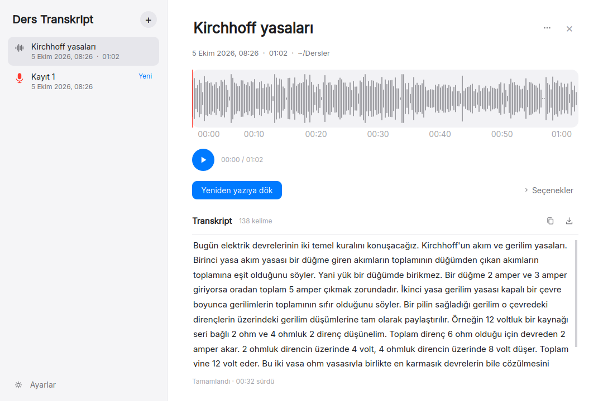
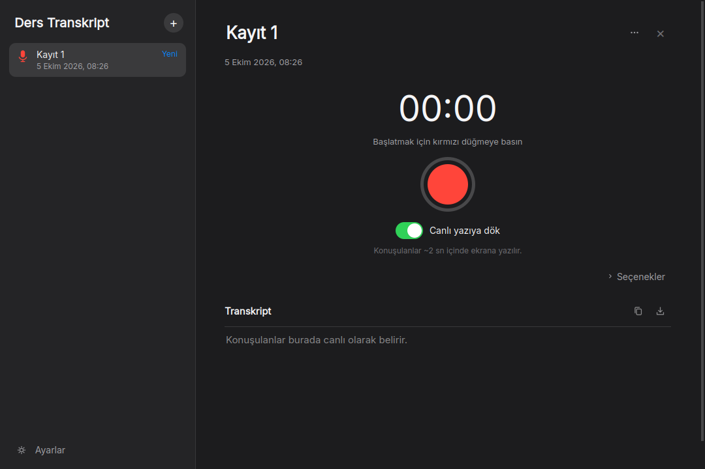

# Ders Transkript

**Ders Transkript is an offline desktop app that turns lecture recordings and live microphone input
into text.** It runs OpenAI's Whisper speech-recognition model (via faster-whisper) entirely on your own
computer: no internet connection, no account, and no audio ever leaves the machine. It ships as a
ready-to-run package for Windows, macOS and Linux with the models included. It was built by
[Eren Can Almaz](https://writerforight.github.io), an Electrical Engineering student at RWTH Aachen
University, originally for transcribing hour-long university lectures.

*Türkçe açıklama aşağıda: [Türkçe](#türkçe).*



## Download

Pick the file for your computer. It contains the speech models, so nothing else needs to be installed
(about 1.5 GB). The links always point to the **latest version**.

| Computer | Download | Install |
|---|---|---|
| **Windows** 10/11 | [⬇ DersTranskript-windows.zip](https://github.com/writerforight/ders-transkript/releases/latest/download/DersTranskript-windows.zip) | Extract the zip → run `DersTranskript.exe` |
| **Mac** (Apple M1–M4), macOS 14+ | [⬇ DersTranskript-mac-apple-silicon.dmg](https://github.com/writerforight/ders-transkript/releases/latest/download/DersTranskript-mac-apple-silicon.dmg) | Open the DMG, drag the app into **Applications** |
| **Mac** (Intel), macOS 13+ | [⬇ DersTranskript-mac-intel.dmg](https://github.com/writerforight/ders-transkript/releases/latest/download/DersTranskript-mac-intel.dmg) | same |
| **Linux** (Ubuntu 22.04+, Debian 12+, Fedora 36+) | [⬇ DersTranskript-linux.tar.gz](https://github.com/writerforight/ders-transkript/releases/latest/download/DersTranskript-linux.tar.gz) | Extract, run `./kur.sh` → **Ders Transkript** in the app menu |

The app is not signed with a paid developer certificate, so the first launch shows a warning once:
on Windows choose **More info → Run anyway**; on macOS try to open it, then **System Settings →
Privacy & Security → Open Anyway**.

## Features

- **Offline speech recognition** with two quality levels: *Standard* (Whisper small, fast) and *High*
  (Whisper large-v3-turbo, noticeably fewer errors on lectures). Language is detected automatically or
  can be fixed.
- **Live recording with live transcription**: speech appears on screen about 2 seconds after it is
  spoken, with a greyed-out draft that becomes final text; recording can be paused and resumed.
- **Audio files**: drag and drop mp3, m4a, wav, aac, ogg, opus, flac, wma and more.
- **Waveform view**: zoom, play, and select a range to play or transcribe only that part.
- **Transcripts**: optional timestamps, word count, copy, save as `.txt`; earlier transcripts are
  reopened automatically.
- **CPU modes** (quiet / balanced / fast) so the computer stays usable while a long lecture is processed.
- **Advanced mode (for engineers)**: a signal-analysis window with STFT and wavelet spectrograms, noise
  reduction, speech boost, silence trimming and before/after/difference views; tunable live-preview
  parameters.
- **Interface** in Turkish, English and German; light and dark themes.
- **Update notice**: on start it reads only the latest version number on GitHub; recordings and text are
  never sent anywhere (can be turned off).



## How it works

The app is written in Python with PyQt6. Speech recognition uses
[faster-whisper](https://github.com/SYSTRAN/faster-whisper), a CTranslate2 implementation of Whisper,
running with int8 weights on the CPU. The large-v3-turbo model is stored on disk in int8 as well
(`tools/quantize_ct2.py`), which halves the download size without changing the transcript: the
quantization matches what CTranslate2 does at load time, and the output is bit-for-bit identical.
Live transcription cuts the microphone stream at pauses, transcribes each piece with the previous
text as context, and shows a fast draft from a small model in the meantime. Packages for all four
platforms are built and self-tested by GitHub Actions (`.github/workflows/build.yml`).

## All versions

| Version | Date | What's new | Windows | Mac (Apple M) | Mac (Intel) | Linux |
|---|---|---|---|---|---|---|
| **v1.2** | 2026-10-05 | Fix: microphone permission error on Mac | [⬇](https://github.com/writerforight/ders-transkript/releases/download/v1.2/DersTranskript-windows.zip) | [⬇](https://github.com/writerforight/ders-transkript/releases/download/v1.2/DersTranskript-mac-apple-silicon.dmg) | [⬇](https://github.com/writerforight/ders-transkript/releases/download/v1.2/DersTranskript-mac-intel.dmg) | [⬇](https://github.com/writerforight/ders-transkript/releases/download/v1.2/DersTranskript-linux.tar.gz) |
| **v1.1** | 2026-10-03 | Cleaner, Mac-style interface | [⬇](https://github.com/writerforight/ders-transkript/releases/download/v1.1/DersTranskript-windows.zip) | [⬇](https://github.com/writerforight/ders-transkript/releases/download/v1.1/DersTranskript-mac-apple-silicon.dmg) | [⬇](https://github.com/writerforight/ders-transkript/releases/download/v1.1/DersTranskript-mac-intel.dmg) | [⬇](https://github.com/writerforight/ders-transkript/releases/download/v1.1/DersTranskript-linux.tar.gz) |
| **v1.0** | 2026-10-02 | First release | [⬇](https://github.com/writerforight/ders-transkript/releases/download/v1.0/DersTranskript-windows.zip) | [⬇](https://github.com/writerforight/ders-transkript/releases/download/v1.0/DersTranskript-mac-apple-silicon.dmg) | [⬇](https://github.com/writerforight/ders-transkript/releases/download/v1.0/DersTranskript-mac-intel.dmg) | [⬇](https://github.com/writerforight/ders-transkript/releases/download/v1.0/DersTranskript-linux.tar.gz) |

Release notes: [CHANGELOG.md](CHANGELOG.md) · [Releases](https://github.com/writerforight/ders-transkript/releases).
The green **Code → Download ZIP** button downloads the source code only, not the app.

## Run from source

```bash
python3.12 -m venv .venv && source .venv/bin/activate
pip install -r requirements.txt
python transkript.py            # python transkript.py --selftest checks models, decoding and audio
```

The Whisper models are expected under `models/` (see the download step in
`.github/workflows/build.yml`). To publish a release: add a `## vX.Y — date` section to
`CHANGELOG.md`, then `git tag vX.Y && git push origin vX.Y`; GitHub Actions builds, tests and uploads
the four packages.

## Author

**Eren Can Almaz** — Electrical Engineering (Elektrotechnik) student at RWTH Aachen University.
GitHub [@writerforight](https://github.com/writerforight) · website
[writerforight.github.io](https://writerforight.github.io). Other projects:
[Neural Space Deformation](https://github.com/writerforight/mlp-space-deformation) (an interactive
visualization of how neural networks deform space).

## License

Copyright © 2026 Eren Can Almaz. Released under the **GNU General Public License v3.0** — see
[LICENSE](LICENSE). The packaged app includes PyQt6 (GPL-3.0), faster-whisper and CTranslate2 (MIT),
and Whisper model weights from OpenAI (MIT).

---

## Türkçe

**Ders Transkript, ders kayıtlarını ve mikrofon kaydını internetsiz metne çeviren bir masaüstü
uygulamasıdır.** OpenAI'nin Whisper konuşma tanıma modelini tamamen kendi bilgisayarınızda çalıştırır:
internet, hesap gerekmez; ses bilgisayardan dışarı çıkmaz. Windows, macOS ve Linux için modelleri içinde
hazır paketler hâlinde gelir.

### İndirme ve kurulum

Yukarıdaki **Download** tablosundan bilgisayarınıza uygun dosyayı indirin (~1,5 GB). Modeller içindedir,
başka bir şey kurmanız gerekmez.

- **Windows:** Zip'e sağ tık → **Tümünü ayıkla** → klasördeki `DersTranskript.exe`.
- **Mac:** DMG'yi açın, uygulamayı **Uygulamalar** klasörüne sürükleyin.
  **Mac'im hangisi?**  menüsü → **Bu Mac Hakkında**: "Çip: Apple M…" yazıyorsa **Apple Silicon**,
  "İşlemci: … Intel …" yazıyorsa **Intel** dosyası.
- **Linux:** Arşivi açın, klasörde `./kur.sh` çalıştırın → menüde **Ders Transkript**.

**İlk açılıştaki güvenlik uyarısı** (bir kez yapılır):
- **Windows** ("Windows bilgisayarınızı korudu"): **Ek bilgi** → **Yine de çalıştır**.
- **macOS** ("açılamıyor"): bir kez açmayı deneyin, sonra **Sistem Ayarları → Gizlilik ve Güvenlik** →
  en altta **Yine de Aç** (macOS 14'te: sağ tık → **Aç** → **Aç**).
- Canlı kayıt için ilk seferde sorulan **mikrofon izni**ni onaylayın.

### Kullanım

- **+** ile yeni kayıt başlatın ya da bir ses dosyasını pencereye sürükleyin.
- **Doğruluk:** *Standart* (hızlı) veya *Yüksek* (large-v3-turbo, derslerde daha az hata).
- **Canlı yazıya dök** açıkken konuşulanlar ~2 saniyede ekrana yazılır.
- Dalganın üzerinde sürükleyerek bir aralık seçip yalnızca onu dinleyebilir veya yazıya dökebilirsiniz.
- Mikrofon kayıtları `Belgeler/Ders Transkript` klasörüne kaydedilir.
- Yeni sürüm çıktığında uygulama açılışta haber verir; yalnızca sürüm numarasına bakılır.

Lisans: GNU GPL v3.0. Geliştiren: Eren Can Almaz (RWTH Aachen Üniversitesi, Elektrik Mühendisliği).
